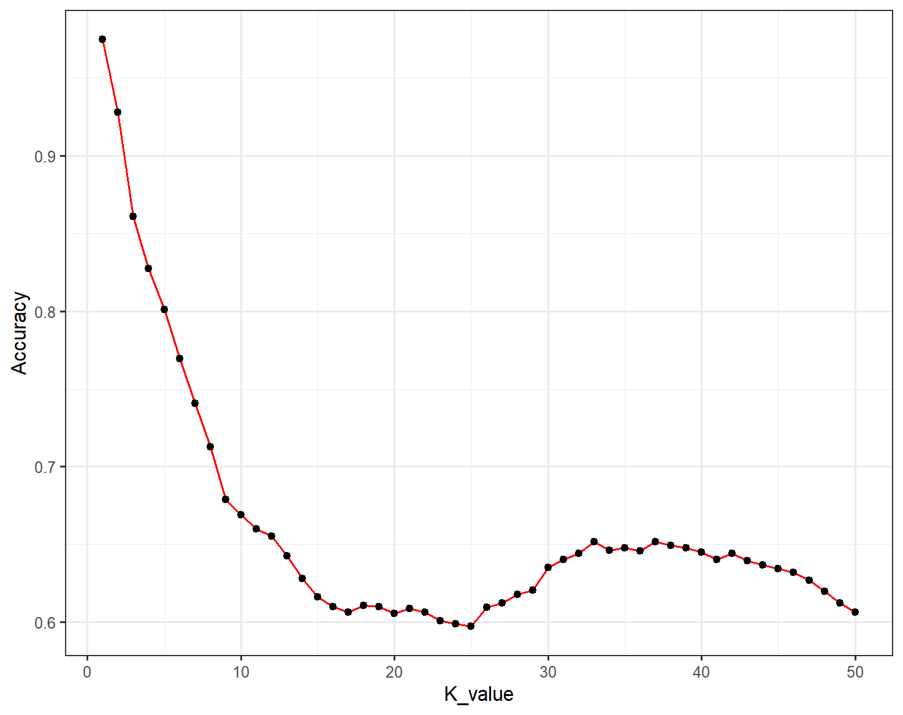
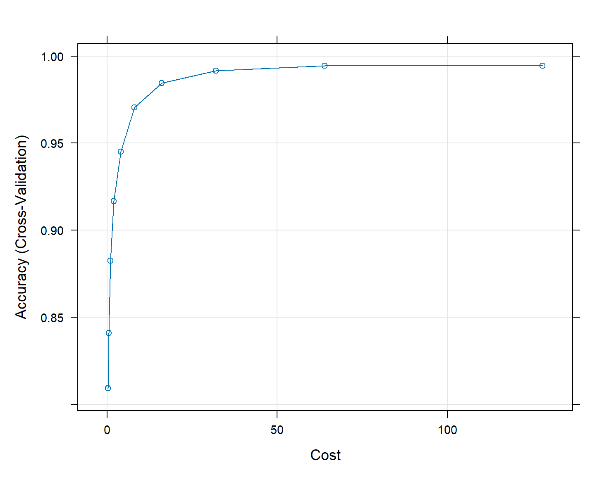
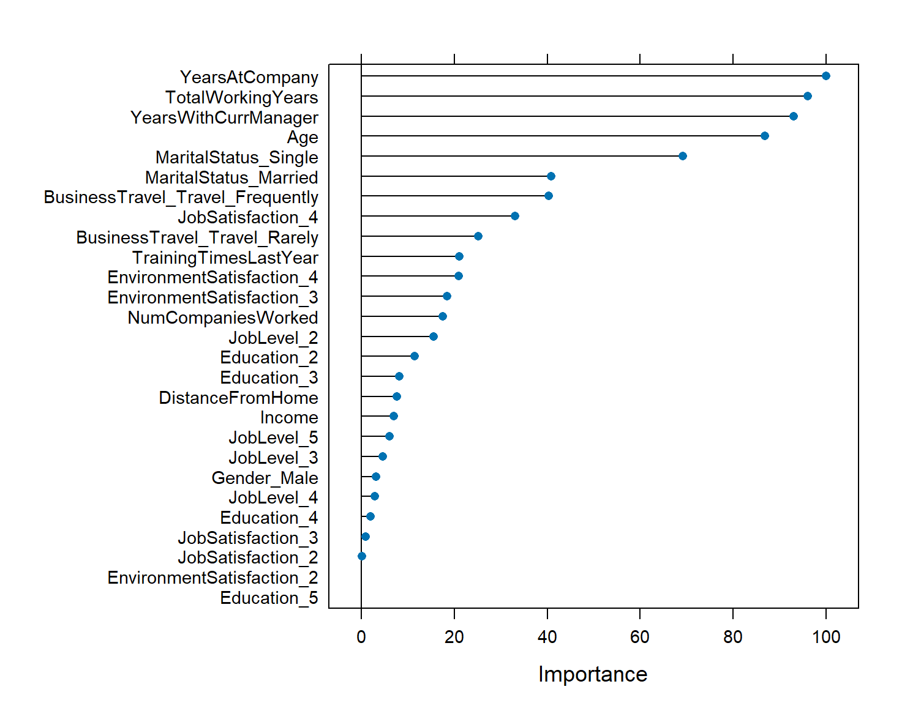
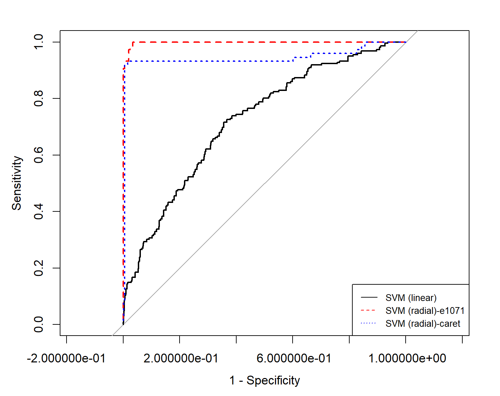

# Employee Retention Analysis at Canterra

## Introduction

In the dynamic corporate landscape, employee retention emerges as a pivotal challenge, particularly for firms like Canterra. This project aims to address this issue by applying machine learning techniques to predict and understand employee turnover. Using the K-Nearest Neighbors (KNN) and Support Vector Machines (SVM) models, we analyzed Canterra’s employee data to identify key factors influencing employee retention. Our goal is to provide Canterra's management with actionable insights for effective strategy formulation to reduce attrition, thereby enhancing workforce stability and organizational efficiency.

## Problem Statement

Canterra is experiencing a significant challenge with a 15% annual employee attrition rate. High turnover impacts operational efficiency, organizational culture, and growth. Our analysis aims to utilize SVM and KNN models to predict attrition, identify its key drivers, and provide actionable insights for effective retention strategies.

## Processing Our Data

Our analysis began with loading a comprehensive dataset consisting of 4,410 employee records, each characterized by 16 unique attributes. The initial step involved sifting through these attributes to retain only those relevant to our study, ensuring each was aptly categorized as either numerical or categorical.

Next, we divided the dataset into two parts: a training set for model development and a testing set for later evaluation. An initial assessment revealed a notable imbalance in our target variable, attrition, with 84% representing 'No Attrition' and 16% 'Yes Attrition' in the training data. A similar distribution was observed in the testing set. To counteract this and avoid model bias, we applied up sampling in the training set, enhancing the presence of the less represented 'Yes Attrition' group. The testing set was left untouched to maintain an unbiased ground for model evaluation. We also identified and rectified missing values. Leaving these gaps unfilled would have meant relying on an incomplete picture of employee attributes, potentially misguiding our model's learning process.

For numerical attributes, we used the average values from the training set to fill gaps in both the training and testing data. This method maintains the overall data distribution. In the case of categorical attributes, we opted for the mode – the most frequent value – as our imputation strategy, ensuring the predominant trends in categories were preserved.

The final step in our data preparation involved transforming categorical variables using dummy encoding. This process, conducted post-imputation, translates categorical data into a format suitable for machine learning algorithms. The encoding was uniformly applied to both sets, ensuring consistency and model integrity.

## Model Training, Evaluation & Selection

### KNN

In our analytical approach for the K-Nearest Neighbors (KNN) model, we standardized numerical variables across training and testing datasets, ensuring comparability and enhancing the accuracy of distance-based calculations. Excluding the 'Attrition' target variable, we designated the feature sets as train_x and test_x, reserving train_y and test_y for outcome variables, pivotal for the KNN model to assimilate and predict employee attrition.

Commencing with a heuristic initial 'k' value, from the square root of the sample size, we embarked on a comprehensive evaluation across an array of 'k' values from 1 to 50. We meticulously recorded each model's accuracy, plotting the results to discern the most effective 'k'. Despite k=1 yielding the highest accuracy, its corresponding AUC score was akin to random chance, a consequence of the disproportionate class distribution in the test data.

To address this imbalance, we employed the CARET package, utilizing its cross-validation capabilities to rigorously test and validate the model. This approach yielded an AUC of 0.95, indicative of the model's enhanced predictive power and its potential utility in formulating strategies for employee retention.

### SVM

We also implemented Support Vector Machine (SVM) classification models into our analysis. Initially, we leveraged a linear SVM, fine-tuning its cost parameter to balance misclassification against strict margins. The optimal cost, ascertained through the 'tune' function, was critical in predicting attrition with an accuracy of 68.93%.

Further enhancing our model, we integrated a Radial Basis Function (RBF) kernel, adept at systematic tuning for 'cost' and 'gamma' through the 'tune' function yielded an impressive accuracy of 98.03%, indicating a substantial predictive capability.

To consolidate our analysis, we turned to the 'caret' package. By opting for an RBF kernel and a 10-fold cross-validation, we achieved an accuracy of 98.26%, mirroring the performance of the RBF model from the 'e1071' package.

### Selecting the Best Model

In our comparative analysis, we referred to the AUC to determine the best model for predicting employee attrition. Our evaluation focused on the most performant models from each algorithm, with the cross-validated KNN model achieving an AUC of 0.9486 and the radial SVM model demonstrating a superior AUC of 0.9983. This stark difference in AUC, as depicted in Figure 3 in the Appendix, led us to select the radial SVM model as our preferred choice for its exceptional ability to distinguish between employee retention and attrition.

## Conclusion and Managerial Insights

Our radial SVM model analysis offers Canterra actionable insights to strengthen employee retention. The key drivers of attrition, as indicated in Figure 4 in the appendix, are the length of service ('YearsAtCompany') and overall work experience ('TotalWorkingYears'). This highlights a retention risk for more established employees and suggests the need for targeted engagement and retention initiatives for this group. The analysis also stresses the importance of the employee-manager relationship ('YearsWithCurrManager'), suggesting that managerial support is crucial for retention. Moreover, the similar impact of 'MaritalStatus_Married' and 'BusinessTravel' on attrition points to work-life balance challenges, especially for married employees frequently on the move. Addressing these concerns through flexible policies may help in reducing turnover.

In summary, by applying the insights from our classification models, Canterra can proactively manage factors that lead to employee turnover. Incorporating these models into their human resource strategy will enable Canterra to preemptively identify at-risk employees and take corrective action, fostering a more committed and contented workforce.
